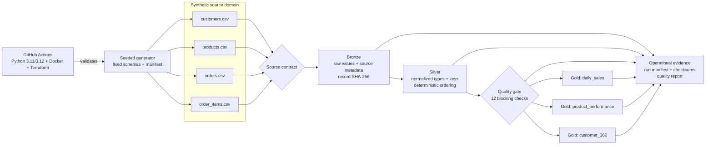

# Retail Lakehouse Platform


An idempotent, quality-gated retail lakehouse reference implementation built
with the Python standard library. It demonstrates how I approach data contracts,
lineage, deterministic testing, dimensional outputs, CI, containerization, and
infrastructure-as-code using senior-level data engineering practices.

> **Portfolio disclosure:** This is a self-directed demonstration project. Every
> customer, product, order, email address, metric, and identifier is synthetic.
> The Azure Terraform is an illustrative design and has not been deployed. No
> production employer or client system is represented.

## What this demonstrates

- Deterministic source generation with referentially consistent retail entities
- Atomic, idempotent bronze → silver → gold processing
- Stable run IDs, record hashes, source/output checksums, and lineage metadata
- Blocking schema, uniqueness, domain, reconciliation, and foreign-key checks
- Business-ready daily sales, product performance, and customer 360 tables
- Dependency-free local execution and tests that need no cloud credentials
- Matrix CI, container smoke tests, and static Terraform validation
- Private-by-default illustrative Azure lakehouse infrastructure

## Architecture



The local engine intentionally separates domain logic from cloud services. That
makes transformations fast to test while leaving clear migration seams for
Spark/Delta Lake, ADLS Gen2, Azure Databricks, orchestration, and observability.
See [Architecture](docs/architecture.md) for the production evolution path.

## Quick start

Only Python 3.11+ is required:

```bash
make demo
make test
```

Or run each stage explicitly:

```bash
PYTHONPATH=src python3 -m retail_lakehouse.cli generate \
  --output data/raw --seed 20260728 --customers 50 --products 20 --orders 200

PYTHONPATH=src python3 -m retail_lakehouse.cli run \
  --input data/raw --output warehouse
```

The second command can be repeated safely. Identical sources generate identical
run IDs, curated tables, checksums, and manifests; each target is atomically
replaced rather than appended.

## Reproducible sample result

The checked-in example was produced with seed `20260728`, 50 customers, 20
products, and 200 orders:

| Evidence | Observed value |
|---|---:|
| Source orders | 200 |
| Source order lines | 498 |
| Completed orders | 176 |
| Completed synthetic revenue | CAD 194,928.03 |
| Active purchasing customers | 50 |
| Gold daily partitions represented | 30 |
| Blocking quality checks passed | 12 / 12 |
| Run ID | `67ec2c585afb3b7e` |

These are demo outputs, not business results. Reproduce them with `make demo`
and compare the generated manifest to
[the sample metrics](examples/sample_metrics.json).

## Data products

| Layer | Table | Grain | Primary use |
|---|---|---|---|
| Bronze | customers, products, orders, order_items | Source record | Replay, traceability, forensic comparison |
| Silver | customers | Customer | Governed customer attributes |
| Silver | products | Product | Typed price/cost catalog |
| Silver | orders | Order | Canonical transaction header |
| Silver | order_items | Order line | Canonical transaction detail |
| Gold | daily_sales | Sales date | Revenue and volume trend |
| Gold | product_performance | Product | Revenue, units, and margin |
| Gold | customer_360 | Customer | Lifetime value and recency |

Field-level expectations, keys, and reconciliation rules live in
[Data contracts](docs/data-contracts.md).

## Reliability design

1. **Deterministic inputs:** a local `random.Random` instance and fixed seed make
   the generated domain reproducible without leaking global random state.
2. **Fail-fast contracts:** required tables and columns are checked before any
   curated layer is published.
3. **Blocking quality gate:** duplicate keys, invalid values, orphan references,
   missing lines, and header-to-line total mismatches stop gold publication.
4. **Idempotent writes:** temporary files are flushed and atomically promoted,
   while deterministic sorting prevents output drift.
5. **Lineage evidence:** the run ID derives from all input file hashes; manifests
   retain row counts, quality status, business metrics, and output checksums.
6. **Testable core:** transformations run locally with no network, cloud account,
   credentials, database, or third-party Python package.

Operational response and recovery steps are documented in the
[Runbook](docs/runbook.md).

## Repository map

```text
.
├── src/retail_lakehouse/     # Generator, contracts, I/O, pipeline, and CLI
├── tests/                    # Unit, reconciliation, idempotency, failure tests
├── docs/                     # Architecture, contracts, runbook, and ADR
├── examples/                 # Reproducible sample metrics and gold rows
├── terraform/                # Illustrative Azure landing zone; not deployed
├── .github/workflows/ci.yml  # Python matrix, container, and IaC checks
├── Dockerfile
├── Makefile
└── pyproject.toml
```

## Intentional trade-offs

CSV and the standard library keep the demo portable and make the invariants easy
to inspect. A production workload would use Delta/Parquet, partition pruning,
distributed compute, event-time watermarks, a catalog, workload identity,
centralized secrets, data observability, and policy-controlled deployment.
Those extensions are described as a target architecture, not claimed as
implemented here.

## License

MIT. See [LICENSE](LICENSE).
