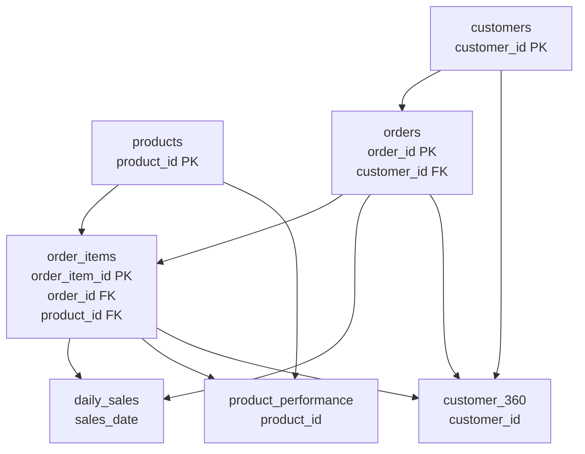

# Architecture

## Decision context

This portfolio project models the boundaries of a production retail lakehouse
while keeping execution local, deterministic, and credential-free. The goal is
to make correctness and operational behavior reviewable in minutes.

## Processing flow

| Stage | Responsibility | Failure behavior |
|---|---|---|
| Generate | Create fictional, referentially consistent source tables | Invalid sizes fail before writing |
| Source gate | Confirm every table and required field exists | Quality report written; run stops |
| Bronze | Preserve source values and add ingestion lineage | No downstream publication on error |
| Silver | Normalize identifiers, text, dates, enums, and money | Parse or contract failure stops run |
| Silver gate | Enforce uniqueness, domains, foreign keys, and totals | Gold publication is blocked |
| Gold | Aggregate completed sales into three data products | Empty outputs are rejected |
| Manifest | Record fingerprint, run ID, counts, metrics, checksums | Written after all data succeeds |

Each CSV is written to a sibling temporary file and promoted with an atomic
filesystem replace. The input fingerprint is a SHA-256 over sorted file names and
file digests, so the same input set always has the same run identity.

## Logical data lineage

## Production evolution path

The local modules map cleanly to a cloud implementation:

| Local reference | Production analogue |
|---|---|
| CSV source directory | Event stream, SFTP landing zone, or operational CDC |
| Atomic file replace | Transactional Delta Lake merge |
| Python transformations | PySpark or SQL jobs with shared contracts |
| CSV medallion directories | ADLS Gen2 + Delta tables + Unity Catalog |
| CLI invocation | Workflow orchestrator with retry/backfill policies |
| JSON quality report | Data observability events and incident routing |
| Local checksums | Delta commit metadata and audit tables |
| Local unit tests | Unit, contract, integration, and canary suites |

### Scale and recovery

- Partition bronze by ingestion date and silver/gold by the dominant query key.
- Use checkpointed incremental reads and merge keys rather than full snapshots.
- Retain source event IDs to deduplicate retries and late delivery.
- Separate quarantine from retryable infrastructure failures.
- Support bounded backfills with explicit start/end parameters and isolated
  compute.
- Publish table freshness, volume, invalid-row, duration, and cost metrics.

### Security and governance

- Managed identities and least-privilege RBAC; no shared access keys.
- Private endpoints, controlled egress, private DNS, and deny-by-default storage.
- Catalog-level ownership, column classification, masking, and audit logs.
- Customer-managed encryption keys when required by the threat model.
- CI plan review, policy-as-code, protected environments, and manual production
  approval.

The Terraform directory sketches only a subset of this target and is clearly
marked as illustrative/not deployed.

